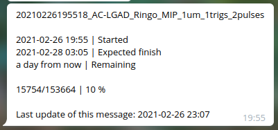

# progressreporting

Report the progress of long time lasting ```for``` and ```while``` loops to your cell phone using a Telegram bot.

## Installation

```
pip3 install git+https://github.com/SengerM/progressreporting
```

## Usage example

The following example shows the best way to use the ```TelegramProgressReporter``` with a loop. The ```with``` statement ensures that the inizialization and finalization is done properly. Also, if for some reason the messages cannot be sent (e.g. the internet connection is temporarily lost) a warning is displayed but the program keeps running. When the connection is restored, the updates are sent.

```Python
from progressreporting.TelegramProgressReporter import TelegramProgressReporter
import time

BOT_TOKEN = 'Token of your bot'
CHAT_ID = 'ID of the chat to which you want to send the updates'

MAX_K = 99

with TelegramProgressReporter(MAX_K, BOT_TOKEN, CHAT_ID, 'I am anxious about this loop') as reporter:
	for k in range(MAX_K):
		print(k)
		reporter.update(1)
		time.sleep(1)
```

The program will send messages to your Telegram chat, below some examples:

- Loop in progress. It sends a single message that is updated each time ```reporter.update(count)``` is called.



- Loop completed. It sends a new message to notify it was completed.


- Loop finished but without reaching 100 % (e.g. because of an error). It sends a new message to notify and in the original message it reports that it did not reach 100 %.


## Creating a bot

To create a Telegram bot you can follow any of the tutorials that are around. To get the **chat ID** just talk to your bot, say "Hi", and then go to ```https://api.telegram.org/bot<YourBOTToken>/getUpdates```.
